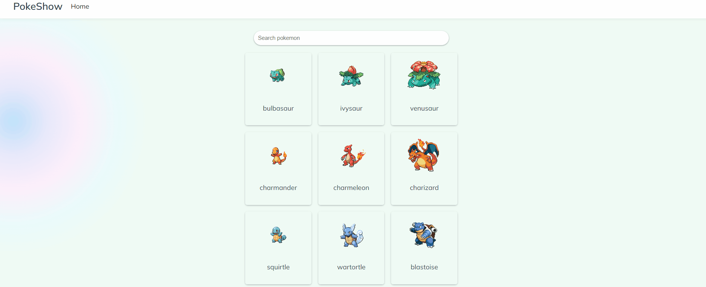

# PokeShow
<h1 align="center">
    
</h1>

# Descrião
Projeto front-end que realiza requisições da API "https://pokeapi.co/", fazendo uso do Vue 3, utilizando conceitos arquitetura de pastas, componentização, uso do PrimeVue, biblioteca de estilização e componentes destinada ao Vue. Projeto desenvolvido utilizando Composition API, services (chamadas para a API) e roteamento com vue-router

# Construído com
 - **Vue.Js - Vue.Js** é um framework JavaScript de código-aberto, focado no desenvolvimento de interfaces de usuário e aplicativos de página única.

## Status do Projeto
**Concluído:** O projeto se encontra finalizado. Podendo haver futuras alterações para implementação de testes

## Autor
- **Desenvolvimento: Leonardo Borges** - Responsável pelo desenvolvimento da aplicação;
